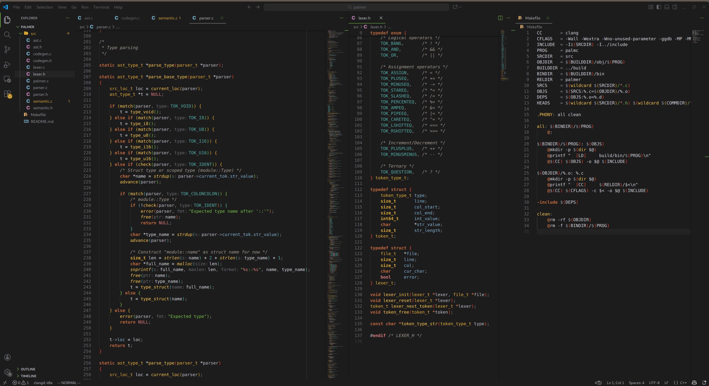

# dalbit.vscode · 달빛

A warm-accent, high-contrast dark color theme for VS Code, inspired by
[gruber-darker](https://github.com/rexim/gruber-darker-theme).



## Install

### Linux / macOS

```bash
./install.sh
```

### Windows (PowerShell)

```powershell
.\install.ps1
```

### Manual

Symlink (or copy) this directory into your VS Code extensions folder:

```bash
# Linux
ln -s "$(pwd)" ~/.vscode/extensions/dalbit-0.1.0

# macOS
ln -s "$(pwd)" ~/.vscode/extensions/dalbit-0.1.0

# Windows (PowerShell, run as admin or with dev mode)
New-Item -ItemType Junction -Path "$env:USERPROFILE\.vscode\extensions\dalbit-0.1.0" -Target (Get-Location)
```

Then: **Ctrl+Shift+P** → `Preferences: Color Theme` → **dalbit**.

Since it's symlinked, edits to the theme files take effect after `Developer: Reload Window`.

## License

MIT.
